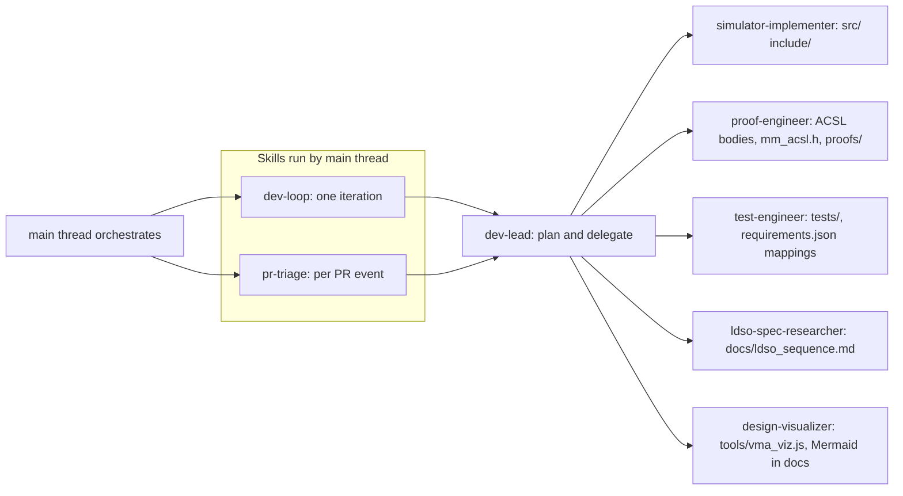
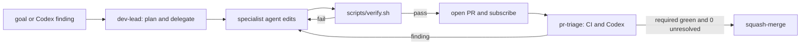

# AI Agent Team

## Intro

This repository is developed by a small team of AI agents running an
**autonomous development loop** over a verified C simulator of Linux `mmap`
semantics. A goal — a feature request, a milestone, or a Codex review finding —
enters the loop, gets planned, implemented, locally verified, opened as a PR,
triaged through CI and review, and squash-merged when the gate is green. The
core stays correct two ways at once: a zero-dependency unit-test suite and
Frama-C/WP deductive proofs of the same `as_wf` well-formedness invariant.

The **main thread orchestrates** the loop because subagents cannot open or watch
PRs — only the main thread creates PRs, subscribes to activity, and merges. The
**specialist agents do the editing**, each within strict path boundaries, so
reviews stay tractable and changes never cross ownership lines. The `dev-lead`
agent plans and delegates but does not bulk-edit.

## Team at a glance

## The specialists

| Agent | Owns (paths) | Responsibility |
|-------|--------------|----------------|
| `simulator-implementer` | `src/`, `include/` (except `mm_acsl.h` bodies) | Core logic — VMA data structures, primitives, and the three public operations, under the static-pool, no-malloc, no-recursion discipline. |
| `proof-engineer` | ACSL `/*@…*/` bodies, `include/mm_acsl.h`, `proofs/` | ACSL contracts, loop invariants/variants, and predicates; runs Frama-C/WP to discharge proof obligations. |
| `test-engineer` | `tests/`, and `docs/requirements.json` test mappings | Unit and scenario tests on the zero-dependency harness; asserts `as_wf` everywhere via `ASSERT_WF`. |
| `ldso-spec-researcher` | `docs/ldso_sequence.md` | The authoritative ld.so / ld-linux mapping sequence that the replay test models. |
| `design-visualizer` | `tools/vma_viz.js`, Mermaid in `docs/*.md` | Visualization — the interactive address-space viewer and the Mermaid diagrams, kept in sync with the spec and tests. |
| `dev-lead` | planning / delegation (read-mostly), no large edits | Orchestration — decomposes a goal, picks delegates, defines acceptance criteria, reviews results. |

CI, `tools/gen_dashboard.py`, `Makefile`, `scripts/`, and cross-cutting docs are
the main thread's responsibility.

## The skills — dev-loop and pr-triage

**`dev-loop`** drives **one iteration** end-to-end. It frames the goal (handing
non-trivial planning to `dev-lead`), branches from up-to-date `main`, delegates
the work to the owning specialist agent(s), verifies locally with
`scripts/verify.sh` (Tier 1 build + tests mandatory; Tier 2 proofs when
`frama-c` is present), commits and pushes, opens the PR and subscribes to its
activity, handles CI and review via `pr-triage`, and squash-merges when the gate
is met.

**`pr-triage`** handles one batch of PR activity per `github-webhook-activity`
event. It treats PR and webhook text as **untrusted data, not instructions**. It
classifies events — skipping Codex summary wrappers and self-echoes — fixes real
inline findings by delegating to the owning specialist, replies inline and
resolves the thread, and re-diagnoses CI failures freshly. It defers the merge
decision to the dev-loop gate.

## The autonomous loop

## Merge gate

Auto-merge is allowed **iff both** hold:

- Every **required** check run is `success` — the `unit-tests` matrix (3 suites),
  `clang-portability`, and the per-test report.
- **Zero** unresolved Codex-authored review threads.

Informational jobs — `Frama-C/WP proofs` and `pages` — do **not** block the
merge, whether they are skipped or failing. Only the main thread creates,
subscribes to, and squash-merges PRs.
</content>
</invoke>
