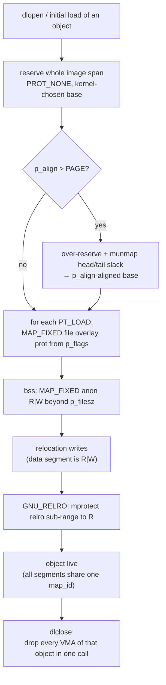

# mmap Requirements for a Dynamic Linker

**Demand-side specification.** The other design docs describe what this
simulator's operations *do* (`docs/mmap_model_spec.md`) and the exact sequence a
loader replays (`docs/ldso_sequence.md`). This document turns the question
around: **what must the virtual-memory layer provide so that a dynamic linker
(`ld-linux` / `ld.so`) can be built on top of it?** Each loader task is stated as
a normative requirement on mmap, mapped to the operation that satisfies it, and
marked with its conformance status in the current model. A closing gap analysis
lists what a *complete* production linker would additionally need beyond this
model's deliberate boundary.

Requirement IDs here are `LNK-R*` (must-have, satisfied by the model) and
`LNK-G*` (gap: needed by a real linker, out of this model's scope). Each links to
the model operation and to the implementation-side requirement (`REQ-*` in
`docs/requirements.json`) that carries its test coverage.

## Relation to the other documents

| Document | Viewpoint |
|---|---|
| `docs/mmap_model_spec.md` | Supply side — what each `mm_*` operation does and the `as_wf` invariant it preserves. |
| `docs/ldso_sequence.md` | Narrative — the concrete step-by-step replay of a real loader mapping an object. |
| **this document** | **Demand side — the requirements a dynamic linker places on mmap, and the gaps to a full linker.** |

## 1. Scope and the pure-bookkeeping boundary

A dynamic linker touches the VM layer for exactly one purpose: to **lay out and
protect the address ranges** of the objects it loads. It does *not* need the VM
layer to move bytes — relocation, symbol binding, and TLS initialisation write
through mappings the linker has already established. This model captures the
layout/protection contract faithfully and models **no real memory or file
content** (see `docs/mmap_model_spec.md` §Model). The requirements below are
therefore all about *where mappings live, what protection they carry, and how
they are created, resized, reprotected, and torn down* — never about their
contents.

Constants referenced (`include/mm_types.h`): `PAGE_SIZE = 4096`,
`PROT_{NONE,READ,WRITE,EXEC}`, `MAP_{PRIVATE,ANONYMOUS,FIXED,FIXED_NOREPLACE}`,
status codes `MM_{OK,EINVAL,ENOMEM,EEXIST}`.

## 2. Loader lifecycle → VM operations

Every arrow that crosses into the VM layer is one of the requirements in §3.

## 3. Normative requirements (satisfied by the model)

### LNK-R1 — Whole-image reservation at a kernel-chosen base
The VM layer **MUST** create a single `PROT_NONE`, private, anonymous mapping of
an arbitrary page-multiple length at an address it chooses (`addr = 0`, no
`MAP_FIXED`), returning that base. *Why:* the loader reserves the full
`l_map_start..l_map_end` span first so that every segment placement is a fixed
offset from one base and inter-segment gaps stay inaccessible.
*Satisfied by:* `mm_mmap(0, span, PROT_NONE, MAP_PRIVATE|MAP_ANONYMOUS)` →
`as_find_free` top-down first-fit. *Trace:* REQ-LDSO-1, REQ-MMAP-HINT.
*Status:* **Modeled.**

### LNK-R2 — Over-reserve and trim to a `p_align`-aligned base
When a segment demands `p_align > PAGE_SIZE`, the VM layer **MUST** support
reserving `span + p_align - PAGE` and then **unmapping the head and tail slack**
so the kept region starts at a `p_align`-aligned address. *Why:* a plain
reservation gives no control over the kernel-chosen base's alignment; glibc's
`_dl_map_segments` over-reserves and trims. *Satisfied by:* `mm_munmap` of the
head range `[base, aligned_base)` and the tail range
`[aligned_base+span, base+reservation_len)`; either may be empty.
*Trace:* REQ-LDSO-5, REQ-MUNMAP-HOLE. *Status:* **Modeled.**

### LNK-R3 — Fixed, overlaying placement of a file-backed segment
The VM layer **MUST** map a file-backed segment at an exact page-aligned address
*inside* the reservation, **overlaying** whatever is currently there (the
`PROT_NONE` reservation), with a protection derived from `p_flags` (text `R|X`,
data `R|W`) and a page-aligned file offset. *Why:* each `PT_LOAD` is placed with
`MAP_FIXED | MAP_PRIVATE` at `base + (p_vaddr & ~pagemask)`; `MAP_FIXED` is the
"punch a hole in the reservation and fill it" primitive the loader depends on.
*Satisfied by:* `mm_mmap(addr, len, prot, MAP_FIXED|MAP_PRIVATE, VMA_FILE, fd,
offset)` — split at the boundaries, remove covered VMAs, insert the new one.
*Trace:* REQ-LDSO-2, REQ-MMAP-FIXED. *Status:* **Modeled.**

### LNK-R4 — Anonymous zero-fill (bss) adjacent to file content
Where `p_memsz > p_filesz`, the VM layer **MUST** map anonymous `R|W` pages via
`MAP_FIXED` beyond the file-backed portion, and **MUST NOT** coalesce them with
the neighbouring file mapping (different backing). *Why:* bss is zero-initialised
memory with no file backing; it must stay a distinct region. *Satisfied by:*
`mm_mmap(addr, len, PROT_READ|PROT_WRITE, MAP_FIXED|MAP_PRIVATE|MAP_ANONYMOUS)`;
the `as_wf` canonical rule keeps anon and file VMAs separate.
*Trace:* REQ-LDSO-3, REQ-WF-4. *Status:* **Modeled.**

### LNK-R5 — Sub-range reprotection with hole rejection (GNU_RELRO)
After relocations, the VM layer **MUST** change the protection of a *sub-range*
of an existing mapping to read-only, splitting the mapping at the sub-range
boundaries, and **MUST** reject the request if any page in the range is unmapped.
*Why:* `PT_GNU_RELRO` hardens relocated pointers by turning part of the data
segment read-only; the loader calls `mprotect` on a precise sub-range.
*Satisfied by:* `mm_mprotect(addr, len, PROT_READ)` — split, set prot, and
`MM_ENOMEM` on a gap. *Trace:* REQ-LDSO-4, REQ-MPROTECT-GAP,
REQ-OP-MPROTECT-REMERGE. *Status:* **Modeled.**

### LNK-R6 — Per-object identity that blocks accidental coalescing
The VM layer **MUST** attach a logical identity to each object's mappings such
that adjacent, otherwise-compatible VMAs belonging to **different** objects never
merge, while the internal splits of **one** object (RELRO split, data/bss) may
re-merge once compatible again. *Why:* the executable and each dependency are
loaded into separate reservations that may abut by chance; merging across an
object boundary would make later per-object teardown impossible and corrupt the
loader's view of the layout. *Satisfied by:* the `map_id` field — `vma_mergeable`
requires equal `map_id`; `as_canonicalize` never crosses the boundary.
*Trace:* REQ-LDSO-6, REQ-WF-4. *Status:* **Modeled.**

### LNK-R7 — Object-scoped grouping of a multi-segment object
The VM layer **MUST** let the loader stamp *every* segment overlay of one object
with the **same** identity, so a multi-segment object (text + rodata + data +
bss) is one logical group rather than several independent mappings. *Why:*
`dlopen` maps several `PT_LOAD` overlays for one object; they must be unloadable
as a unit. *Satisfied by:* `mm_mmap_obj(..., map_id, out)` — `map_id == 0` mints
a fresh id, a non-zero id is stamped verbatim (`mm_mmap` is `mm_mmap_obj(...,
0)`). *Trace:* REQ-LDSO-UNLOAD (setup half), REQ-WF-4. *Status:* **Modeled.**

### LNK-R8 — Whole-object teardown in one action (dlclose)
The VM layer **MUST** remove *every* mapping belonging to one object in a single
operation, leaving all other objects byte-for-byte intact, and **MUST** be
idempotent (unloading an already-absent object is a success no-op). *Why:*
`dlclose` unmaps all of an object's segments at once. *Satisfied by:*
`mm_munmap_object(map_id)` — drops every VMA with that id; a proven
*no-surviving-map_id* postcondition; unknown id → `MM_OK`.
*Trace:* REQ-LDSO-UNLOAD. *Status:* **Modeled.**

### LNK-R9 — Fail-if-occupied fixed placement (`MAP_FIXED_NOREPLACE`)
The VM layer **SHOULD** support claiming an exact address range *only if it is
free*, failing atomically (no mutation) if anything already maps into it. *Why:*
a loader or the runtime allocator that wants a specific address without clobbering
an existing mapping uses `MAP_FIXED_NOREPLACE` (Linux ≥ 4.17) to avoid the
silent-overlay footgun of bare `MAP_FIXED`. *Satisfied by:*
`mm_mmap(..., MAP_FIXED_NOREPLACE, ...)` → `MM_EEXIST` on any overlap, else places
like `MAP_FIXED`. *Trace:* REQ-OP-NOREPLACE. *Status:* **Modeled.**

### LNK-R10 — Partial unmap that splits a mapping
The VM layer **MUST** support unmapping an interior page range of a single
mapping, splitting it into a head and a tail, and tolerate unmapping ranges that
are already (partly) unmapped. *Why:* the alignment trim (LNK-R2) and general
teardown carve holes out of existing regions. *Satisfied by:* `mm_munmap` —
split at both endpoints, remove covered VMAs. *Trace:* REQ-MUNMAP-HOLE,
REQ-OP-MUNMAP-SPLIT. *Status:* **Modeled.**

### LNK-R11 — Resize an existing mapping (`mremap`)
The VM layer **MAY** resize a whole mapping in place (shrink; grow into a free
tail) or relocate it when growth needs room (`MREMAP_MAYMOVE`), preserving the
mapping's protection, flags, backing, file offset continuity, and **identity**
across the move. *Why:* not core to `ld.so` segment mapping, but part of a
complete mmap family and used by allocators the runtime relies on; identity
preservation keeps a moved mapping groupable/unloadable. *Satisfied by:*
`mm_mremap(old_addr, old_len, new_len, flags, out)` — equal/shrink/grow-in-place/
grow-with-move, source must be exactly one whole VMA. *Trace:* REQ-OP-MREMAP-*
(SHRINK, GROW, MOVE, FILE, WHOLE). *Status:* **Modeled.**

### LNK-R12 — Bounded, atomic, overflow-safe operations
Every VM operation **MUST** be all-or-nothing: on capacity exhaustion or invalid
arguments it returns an error (`MM_ENOMEM` / `MM_EINVAL`) and mutates nothing,
and **MUST** guard every `addr + length` and page round-up against `uint64_t`
overflow. *Why:* a loader that observes a partially-applied mapping operation
would build an inconsistent layout; wrap-around near the top of the address space
must never produce a bogus VMA. *Satisfied by:* the pre-flight capacity check in
`split_boundaries`, the `add_overflows` / `round_up_overflows` guards, and the
`ensures 0 <= count <= VMA_CAP` contract. *Trace:* REQ-OP-ATOMIC,
REQ-MMAP-VALIDATE, REQ-OP-LEN-ROUNDUP, REQ-OP-ASMAX-BOUNDARY.
*Status:* **Modeled (WP-proved count clause + all RTE).**

## 4. Invariants the linker relies on

Beyond the individual operations, a dynamic linker depends on **global
consistency** of the address space after every call — the `as_wf` invariant
(`docs/mmap_model_spec.md` §Well-formedness). Concretely the loader assumes:

- **Sorted, non-overlapping VMAs** (`REQ-WF-3`) — so "is `[a,b)` free?" and
  "what covers this address?" have unambiguous answers when placing the next
  segment or reserving the next object.
- **Canonical form** (`REQ-WF-4`) — the layout is the minimal set of maximal
  ranges, so the loader's view never fragments spuriously; yet the `map_id`
  clause guarantees object boundaries survive (LNK-R6).
- **Bounded capacity** (`REQ-WF-1`) — operations fail cleanly rather than
  corrupting state when the fixed arena is full.
- **Page alignment** of every `start`/`end` and file offset (`REQ-WF-2`) — the
  loader's `p_vaddr & ~pagemask` arithmetic stays exact.

The runtime oracle `as_check_wf` asserts all of these after every operation
(`ASSERT_WF` in the tests); the count clause plus all memory-safety obligations
are additionally WP-proved.

## 5. Deliberately excluded (model non-goals)

These are **not** requirements this model chooses to meet; a linker built on the
model must not assume them (see `docs/mmap_model_spec.md` §Out of scope):

- `MAP_SHARED` semantics, `MAP_GROWSDOWN`, `MAP_NORESERVE` accounting.
- `MREMAP_FIXED` (caller-chosen `mremap` destination) — reserved, not
  implemented.
- Distinct hugepage tracking (the alignment *logic* is modeled; pages are
  uniform).
- Bit-exact placement compatibility with a specific kernel (placement is
  deterministic first-fit, not ASLR- or kernel-identical).

## 6. Gap analysis — what a *complete* dynamic linker additionally needs

The requirements in §3 cover the **layout and protection** contract end-to-end.
A production dynamic linker needs more from the surrounding system that is
**out of this model's pure-bookkeeping scope**. These gaps are recorded so a
future implementer knows exactly where the model stops.

### LNK-G1 — Real file-backed content and demand paging
Parsing the ELF header, program headers, dynamic section, and symbol/string
tables requires the mapped file's **actual bytes**, with copy-on-write
(`MAP_PRIVATE`) demand paging. The model tracks `fd` + `file_offset` as
bookkeeping only — no content, no faults. *Disposition:* fundamental non-goal of
a logical simulator; a real port layers this on the OS `mmap`.

### LNK-G2 — TLS (`PT_TLS`) setup
The loader records each object's TLS image and sets up the static TLS block / DTV
(`_dl_allocate_tls`, `dl-tls.c`). This is memory *allocation and initialisation*,
not address-range overlay, and is unmodeled. *Disposition:* would need a separate
TLS model; not an mmap-layout requirement.

### LNK-G3 — Writable file mappings (`MAP_SHARED`)
Segments are `MAP_PRIVATE` (COW), which the model covers, but a full mmap family
and programs the linker serves also need `MAP_SHARED` file mappings with
write-back / `msync`. *Disposition:* explicitly out of scope (§5).

### LNK-G4 — Executable, stack, and auxv setup
The kernel maps the main executable, initial stack (with `MAP_GROWSDOWN` / guard
pages), and passes the auxiliary vector before `ld.so` runs. The model starts
from an empty address space and does not model stack growth or guard pages.
*Disposition:* environment setup, outside the segment-mapping contract.

### LNK-G5 — File identity and page-cache sharing
A real mapping is keyed by (device, inode); two mappings of the same file share
page cache, and `MAP_PRIVATE` vs `MAP_SHARED` on the same file differ
observably. The model's `fd` is an opaque integer with no identity semantics.
*Disposition:* content-layer concern, tied to LNK-G1.

### LNK-G6 — Concurrency / load lock
`ld.so` serialises loads with `dl_load_lock` and must be async-signal- and
thread-safe. The model is single-threaded bookkeeping with no locking model.
*Disposition:* orthogonal to the layout contract; a port adds its own locking.

### LNK-G7 — Access-control / permission faults
`MM_EACCES` is reserved but unused; the model performs no permission checks
(e.g. mapping a segment `W|X`, or `mprotect` raising exec on a non-exec mapping).
*Disposition:* policy layer, not modeled.

### LNK-G8 — Caller-chosen relocation of a mapping (`MREMAP_FIXED`)
Reserved but not implemented (§5); a complete `mremap` would honor a
caller-specified destination. *Disposition:* known incompleteness of LNK-R11.

## 7. Traceability summary

| Req | Loader task | Model operation | Impl. requirement(s) | Status |
|---|---|---|---|---|
| LNK-R1 | Reserve image span | `mm_mmap` PROT_NONE, addr=0 | REQ-LDSO-1, REQ-MMAP-HINT | Modeled |
| LNK-R2 | Align-overshoot trim | `mm_munmap` head/tail | REQ-LDSO-5, REQ-MUNMAP-HOLE | Modeled |
| LNK-R3 | Map PT_LOAD segment | `mm_mmap` MAP_FIXED file | REQ-LDSO-2, REQ-MMAP-FIXED | Modeled |
| LNK-R4 | bss zero-fill | `mm_mmap` MAP_FIXED anon | REQ-LDSO-3, REQ-WF-4 | Modeled |
| LNK-R5 | GNU_RELRO | `mm_mprotect` sub-range | REQ-LDSO-4, REQ-MPROTECT-GAP | Modeled |
| LNK-R6 | Per-object boundary | `map_id` in `as_wf` | REQ-LDSO-6, REQ-WF-4 | Modeled |
| LNK-R7 | Group object segments | `mm_mmap_obj` shared id | REQ-LDSO-UNLOAD | Modeled |
| LNK-R8 | dlclose teardown | `mm_munmap_object` | REQ-LDSO-UNLOAD | Modeled |
| LNK-R9 | Fail-if-occupied fixed | `MAP_FIXED_NOREPLACE` | REQ-OP-NOREPLACE | Modeled |
| LNK-R10 | Partial unmap/split | `mm_munmap` | REQ-MUNMAP-HOLE, REQ-OP-MUNMAP-SPLIT | Modeled |
| LNK-R11 | Resize mapping | `mm_mremap` | REQ-OP-MREMAP-* | Modeled |
| LNK-R12 | Atomic, overflow-safe | all ops + guards | REQ-OP-ATOMIC, REQ-MMAP-VALIDATE, REQ-OP-LEN-ROUNDUP, REQ-OP-ASMAX-BOUNDARY | Modeled (WP) |
| LNK-G1 | Read ELF file content | — | — | Gap (non-goal) |
| LNK-G2 | TLS / PT_TLS | — | — | Gap |
| LNK-G3 | MAP_SHARED write-back | — | — | Gap (excluded) |
| LNK-G4 | Exec/stack/auxv setup | — | — | Gap |
| LNK-G5 | File identity / page cache | — | — | Gap |
| LNK-G6 | Load lock / concurrency | — | — | Gap |
| LNK-G7 | Permission faults | — (MM_EACCES reserved) | — | Gap |
| LNK-G8 | MREMAP_FIXED | — (reserved) | — | Gap |

**Bottom line:** the twelve `LNK-R*` requirements — the complete
layout-and-protection contract a dynamic linker places on mmap — are all modeled
and test-covered today, and the reservation → overlay → bss → RELRO →
multi-object → dlclose path is exercised end-to-end by
`tests/test_ldso_replay.c`. The `LNK-G*` gaps are the content, TLS, environment,
and concurrency layers a real linker builds *around* this contract, kept out by
the simulator's pure-bookkeeping design.
