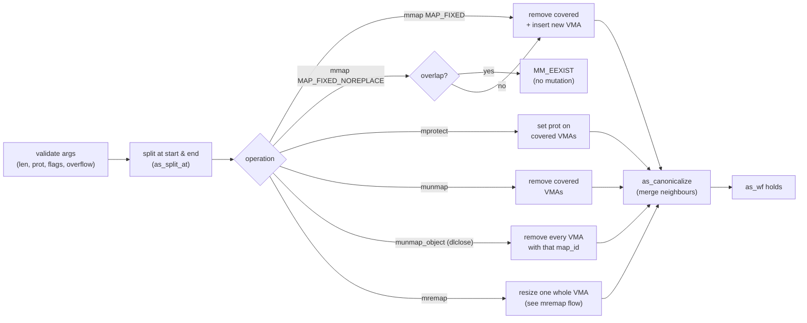
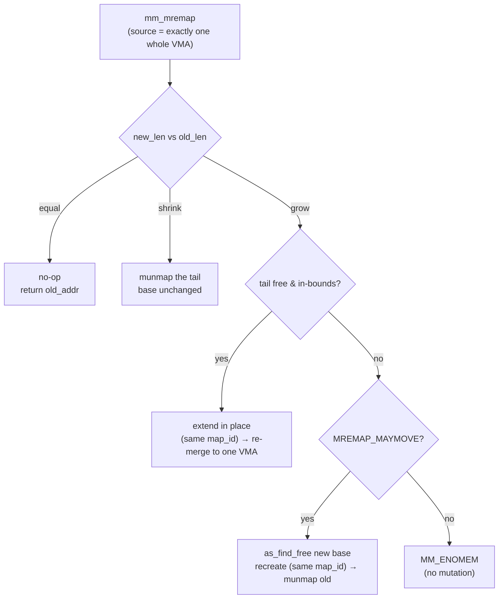

# mmap Model Specification

Precise semantics of the simulator's three operations and the invariant they
preserve. This is the contract the C implementation (`src/`), the ACSL
predicates (`include/mm_acsl.h`), and the runtime oracle (`as_check_wf`) all
agree on.

## Model

The virtual address space is a `struct addr_space` holding a fixed-capacity
array `vmas[VMA_CAP]` of `count` valid VMAs plus bounds `[as_min, as_max)`.
No real memory is allocated; this is pure bookkeeping.

A VMA is a half-open range `[start, end)` (end exclusive) with a protection
bitmask, persistent flags (`MAP_PRIVATE`/`MAP_ANONYMOUS`), a backing
(`VMA_ANON` or `VMA_FILE` with `fd`+`file_offset`), and a `map_id`.

## Well-formedness invariant (`as_wf`)

After every public operation the following all hold:

1. `count <= VMA_CAP` and `as_min <= as_max`.
2. Each VMA `k`: `as_min <= start < end <= as_max`, `start` and `end`
   page-aligned (and `file_offset` page-aligned when file-backed), and
   `prot & ~PROT_ALL == 0`.
3. **Sorted & disjoint**: `vmas[k].end <= vmas[k+1].start` for all `k`.
4. **Canonical**: no adjacent pair `(k, k+1)` is *mergeable* (same prot,
   flags, backing, same `map_id`, and — for files — same fd with contiguous
   offset). Such pairs are always merged into one VMA. The `map_id` clause
   keeps distinct logical mappings (e.g. different ld.so objects) from
   coalescing even when otherwise compatible; the two halves of one mapping
   share a `map_id` and still re-merge once their protections line up again
   (see `docs/ldso_sequence.md` §"multi-object load").

The runtime mirror is `as_check_wf()`; the ACSL predicate is `as_wf` in
`include/mm_acsl.h`. They must stay in lockstep.

## Primitives (`src/vma.c`, `src/addr_space.c`)

- `as_find_range(as, start, end, &lo, &hi)` — the half-open index range of
  VMAs overlapping `[start, end)`. When empty, `lo == hi` is the sorted
  insertion point.
- `as_split_at(as, idx, addr)` — split VMA `idx` at interior page-aligned
  `addr` into two adjacent VMAs; the right half's `file_offset` advances by
  the left half's size. Needs a free slot (`MM_ENOMEM` if full).
- `as_insert_at` / `as_remove_range` — bounded array insert/delete.
- `as_canonicalize(as)` — single left-to-right compaction pass merging
  adjacent mergeable VMAs; restores invariant #4.
- `as_find_free(as, len, &out)` — top-down first-fit placement of a free hole.

## Operations (`src/mmap_ops.c`)

All reject `length == 0` (`MM_EINVAL`), reject prot/flags outside their masks,
and guard `addr + length` / page round-up against `uint64_t` overflow.

All three reduce to the same shape — split at the range boundaries, edit the
covered VMAs, then canonicalize:



> Step through each operation interactively in the inline widgets below.

### `mm_mmap`
- Round `length` up to a page multiple. File-backed requires page-aligned
  `offset`.
- **Placement**: with `MAP_FIXED`, `addr` must be page-aligned and within
  bounds; the range `[addr, addr+len)` is *overlaid* — split at the
  boundaries, remove fully-covered VMAs, then insert the new one (the
  "punch a hole and fill it" step ld.so relies on). Without `MAP_FIXED`, a
  page-aligned, in-bounds `addr` hint is honored when the requested range is
  free; otherwise (no hint, unaligned, out of bounds, or occupied) a placement
  is chosen via `as_find_free` (top-down first-fit).
- Insert the new VMA, then `as_canonicalize`. Returns the chosen base in
  `*out_addr`.
- **`MAP_FIXED_NOREPLACE`**: places exactly at `addr` like `MAP_FIXED`, but if
  *any* existing mapping overlaps `[addr, addr+len)` it fails with `MM_EEXIST`
  and changes nothing (a no-mutation early return before the hole-punch),
  instead of overlaying. This activates the otherwise-reserved `MM_EEXIST`.

```vma-viz map-fixed-overlay
```

```vma-viz map-fixed-noreplace
```

### `mm_mprotect`
- The entire `[addr, addr+len)` range must be mapped; a gap yields
  `MM_ENOMEM` (matching the kernel).
- Split at both endpoints, set `prot` on every covered VMA, then
  `as_canonicalize` (newly-equal neighbors may now merge).

```vma-viz mprotect-split-merge
```

### `mm_munmap`
- Split at both endpoints, remove every covered VMA. Unmapped sub-ranges are
  tolerated. Removal cannot create new mergeable neighbors (it creates a gap),
  but `as_canonicalize` is called for uniformity.

```vma-viz munmap-hole
```

### `mm_mremap`
Resize an existing mapping. The source must be **exactly one VMA** spanning
`[old_addr, old_addr+old_len)` (the model resizes a whole mapping; otherwise
`MM_EINVAL`). `old_len`/`new_len` are rounded up to page multiples and overflow-
guarded. Cases:

- **Equal** (`new_len == old_len`): no-op; returns `old_addr`.
- **Shrink** (`new_len < old_len`): `mm_munmap` the tail
  `[old_addr+new_len, old_addr+old_len)`; the base is unchanged.
- **Grow in place** (`new_len > old_len`, the following range is free and
  in-bounds): insert an extension carrying the source's `prot`/`flags`/`backing`/
  `fd`, with `file_offset` continued for file mappings, and the **same `map_id`**;
  `as_canonicalize` re-merges it into one VMA. The base is unchanged.
- **Grow with move** (no room, `MREMAP_MAYMOVE` set): pick a new base via
  `as_find_free`, recreate the region there preserving the source's attributes
  and **`map_id`** (the mapping keeps its identity across the move), then
  `mm_munmap` the old range. The old range is unmapped first, while the address
  space is still well-formed. Returns the new base in `*out_addr`.
- **Grow, no room, no `MREMAP_MAYMOVE`**: `MM_ENOMEM`, no mutation.

`MREMAP_FIXED` (caller-chosen destination) is reserved but not implemented.



```vma-viz mremap-resize
```

### `mm_munmap_object` (dlclose)
Unload an entire shared object in one call: remove every VMA whose `map_id`
matches, via a single left-to-right compaction. Idempotent — an unknown
`map_id` is a no-op returning `MM_OK`. Because removal only opens gaps it cannot
create a newly-mergeable pair, and the post-state guarantees no VMA with that
`map_id` remains (a proven postcondition). This models `dlclose` tearing down a
mapping group placed by the loader.

```vma-viz dlclose-unload
```

## Out of scope (phase 1 non-goals)

`MAP_SHARED` semantics, `MAP_GROWSDOWN`, `MAP_NORESERVE` accounting,
`MREMAP_FIXED` (caller-chosen `mremap` destination), distinct hugepage tracking,
and bit-exact placement compatibility with a specific kernel version. (The
loader's hugepage-alignment *logic* is modeled — see the alignment-overshoot
scenario in `docs/ldso_sequence.md` — even though pages themselves are uniform.)
The placement policy is deterministic but only documented, not claimed
kernel-identical.
