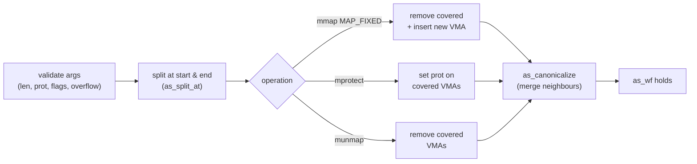

# mmap Model Specification

Precise semantics of the simulator's three operations and the invariant they
preserve. This is the contract the C implementation (`src/`), the ACSL
predicates (`include/mm_acsl.h`), and the runtime oracle (`as_check_wf`) all
agree on.

## Model

The virtual address space is a `struct addr_space` holding a fixed-capacity
array `vmas[VMA_CAP]` of `count` valid VMAs plus bounds `[as_min, as_max)`.
No real memory is allocated; this is pure bookkeeping.

A VMA is a half-open range `[start, end)` (end exclusive) with a protection
bitmask, persistent flags (`MAP_PRIVATE`/`MAP_ANONYMOUS`), a backing
(`VMA_ANON` or `VMA_FILE` with `fd`+`file_offset`), and a `map_id`.

## Well-formedness invariant (`as_wf`)

After every public operation the following all hold:

1. `count <= VMA_CAP` and `as_min <= as_max`.
2. Each VMA `k`: `as_min <= start < end <= as_max`, `start` and `end`
   page-aligned (and `file_offset` page-aligned when file-backed), and
   `prot & ~PROT_ALL == 0`.
3. **Sorted & disjoint**: `vmas[k].end <= vmas[k+1].start` for all `k`.
4. **Canonical**: no adjacent pair `(k, k+1)` is *mergeable* (same prot,
   flags, backing, same `map_id`, and — for files — same fd with contiguous
   offset). Such pairs are always merged into one VMA. The `map_id` clause
   keeps distinct logical mappings (e.g. different ld.so objects) from
   coalescing even when otherwise compatible; the two halves of one mapping
   share a `map_id` and still re-merge once their protections line up again
   (see `docs/ldso_sequence.md` §"multi-object load").

The runtime mirror is `as_check_wf()`; the ACSL predicate is `as_wf` in
`include/mm_acsl.h`. They must stay in lockstep.

## Primitives (`src/vma.c`, `src/addr_space.c`)

- `as_find_range(as, start, end, &lo, &hi)` — the half-open index range of
  VMAs overlapping `[start, end)`. When empty, `lo == hi` is the sorted
  insertion point.
- `as_split_at(as, idx, addr)` — split VMA `idx` at interior page-aligned
  `addr` into two adjacent VMAs; the right half's `file_offset` advances by
  the left half's size. Needs a free slot (`MM_ENOMEM` if full).
- `as_insert_at` / `as_remove_range` — bounded array insert/delete.
- `as_canonicalize(as)` — single left-to-right compaction pass merging
  adjacent mergeable VMAs; restores invariant #4.
- `as_find_free(as, len, &out)` — top-down first-fit placement of a free hole.

## Operations (`src/mmap_ops.c`)

All reject `length == 0` (`MM_EINVAL`), reject prot/flags outside their masks,
and guard `addr + length` / page round-up against `uint64_t` overflow.

All three reduce to the same shape — split at the range boundaries, edit the
covered VMAs, then canonicalize:



> Step through each operation interactively in the inline widgets below.

### `mm_mmap`
- Round `length` up to a page multiple. File-backed requires page-aligned
  `offset`.
- **Placement**: with `MAP_FIXED`, `addr` must be page-aligned and within
  bounds; the range `[addr, addr+len)` is *overlaid* — split at the
  boundaries, remove fully-covered VMAs, then insert the new one (the
  "punch a hole and fill it" step ld.so relies on). Without `MAP_FIXED`, a
  page-aligned, in-bounds `addr` hint is honored when the requested range is
  free; otherwise (no hint, unaligned, out of bounds, or occupied) a placement
  is chosen via `as_find_free` (top-down first-fit).
- Insert the new VMA, then `as_canonicalize`. Returns the chosen base in
  `*out_addr`.

```vma-viz map-fixed-overlay
```

### `mm_mprotect`
- The entire `[addr, addr+len)` range must be mapped; a gap yields
  `MM_ENOMEM` (matching the kernel).
- Split at both endpoints, set `prot` on every covered VMA, then
  `as_canonicalize` (newly-equal neighbors may now merge).

```vma-viz mprotect-split-merge
```

### `mm_munmap`
- Split at both endpoints, remove every covered VMA. Unmapped sub-ranges are
  tolerated. Removal cannot create new mergeable neighbors (it creates a gap),
  but `as_canonicalize` is called for uniformity.

```vma-viz munmap-hole
```

## Out of scope (phase 1 non-goals)

`MAP_SHARED` semantics, `MAP_GROWSDOWN`, `mremap`, hugepages,
`MAP_NORESERVE` accounting, and bit-exact placement compatibility with a
specific kernel version. The placement policy is deterministic but only
documented, not claimed kernel-identical.
